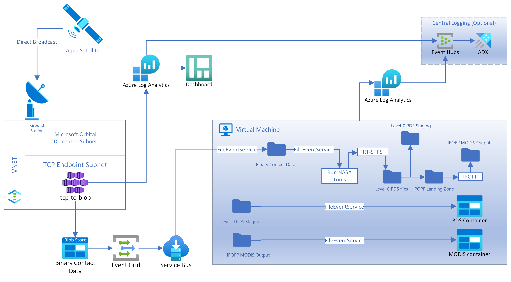

# Azure Orbital Integration
Azure Orbital Integration is a solution that enables end users to easily deploy all downstream components necessary to receive and process direct broadcast data from [NASA's Aqua Earth-Observing Satellite](https://aqua.nasa.gov/) using [Azure Orbital Ground Station(AOGS)](https://docs.microsoft.com/en-us/azure/orbital/overview). This solution provides self-start scripts to create an endpoint to receive data from the ground station (tcp-to-blob component), deploy a virtual machine to process Aqua data using NASA tools (processing VM component) and an optionally bring logs from all components to a single place (central logging component).

# Overview

## Downstream deployment steps
1. Deploy [tcp-to-blob](./tcp-to-blob/README.md)
2. Deploy [Aqua processor](./processor/README.md)
3. (Optional) Deploy [central-logging](./central-logging/README.md)

## AOGS steps
Once you have the downstream components, you can follow these steps to deploy the AOGS components. 

*Please note: during the configuration of the contact profile, you will need to provide endpoint information from the deployment of the tcp-to-blob component.*

1. [Register a spacecraft](https://docs.microsoft.com/en-us/azure/orbital/register-spacecraft).
2. [Configure a contact profile](https://docs.microsoft.com/en-us/azure/orbital/contact-profile)
3. [Schedule a contact](https://docs.microsoft.com/en-us/azure/orbital/schedule-contact)

## Contributing

This project welcomes contributions and suggestions.  Most contributions require you to agree to a Contributor License Agreement (CLA) declaring that you have the right to, and actually do, grant us the rights to use your contribution. For details, visit https://cla.opensource.microsoft.com.

When you submit a pull request, a CLA bot will automatically determine whether you need to provide a CLA and decorate the PR appropriately (e.g., status check, comment). Simply follow the instructions provided by the bot. You will only need to do this once across all repos using our CLA.

This project has adopted the [Microsoft Open Source Code of Conduct](https://opensource.microsoft.com/codeofconduct/). See [CODE_OF_CONDUCT.md](./CODE_OF_CONDUCT.md) in the project root for more information and resources.

## Trademarks

This project may contain trademarks or logos for projects, products, or services. Authorized use of Microsoft trademarks or logos is subject to and must follow [Microsoft's Trademark & Brand Guidelines](https://www.microsoft.com/en-us/legal/intellectualproperty/trademarks/usage/general). Use of Microsoft trademarks or logos in modified versions of this project must not cause confusion or imply Microsoft sponsorship. Any use of third-party trademarks or logos are subject to those third-party's policies.

## Security

See [SECURITY.md](./SECURITY.md) for instructions on reporting security vulnerabilities. **Please do not report security vulnerabilities through public GitHub issues.**

## License

Copyright &copy; 2022 Microsoft. This Software is licensed under the MIT License. See [LICENSE](./LICENSE) in the project root for more information.
